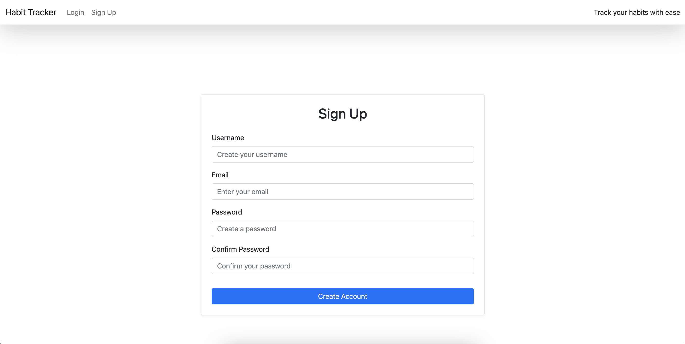

# Habit Tracker

   The Habit Tracker is a full-stack web application that allows users to create, track, and manage their daily habits. It is designed to help users develop and maintain good habits by providing a user-friendly interface to monitor their progress over time.

Link to the deployed project - [Click here](https://habits-tracker-project-a77e8ee5e618.herokuapp.com/)
# Planning Overview

## Site Goals
- Seamless Habit Tracking: Ensure the habit tracker provides a smooth and intuitive experience, allowing users to easily add, edit, and track their habits daily without confusion.

- Clear Guidance: Offer clear and concise instructions within the interface to guide users through each feature, including adding new habits, tracking progress, and marking habits as completed.

- Error Prevention: Implement safeguards to prevent user errors, such as invalid inputs or incomplete forms, ensuring that users can manage their habits and progress without interruptions or data loss.

## First-time User
- Guidance and Onboarding: As a first-time user, I expect to be welcomed with a friendly and easy-to-navigate interface that guides me on how to set up my first habit.

- Instant Feedback: As a first-time user, I want prompt feedback during the habit tracking process, such as confirmation messages when I add my first habit or alerts when I have no habits to complete today.

- Comprehensive Management Options: As a first-time user, I expect to be able to add, edit, mark as completed, and delete habits effortlessly, with the ability to view my progress in a structured and accessible way.

- Progress Tracking: As a first-time user, I want to see my progress clearly, with options to view my daily habits.

# Features
- User Authentication: Sign up, log in, and log out functionalities.
- Habit Management: Add, edit, delete, and mark habits as completed or finished.
- Progress Tracking: Track daily progress for each habit.
- Today's Habits: View a list of habits to complete today and mark them as completed.
- Dashboard: Overview of all habits with options to track progress, edit, delete, or mark them as finished.
- Responsive Design: The application is fully responsive and accessible on both mobile and desktop devices.

# ER Diagram

In this project, the database design centers around three key components: the User, Habit, and Progress. The User model is based on Django's built-in user authentication system, allowing each user to have their own set of habits they want to track.

The **Habit model** represents a habit that a user wants to monitor. Each habit is associated with a specific user, meaning users can only view and manage their own habits. This model includes important details like the habit's name, a description, the date it was started, and whether it has been marked as "finished." By including a "finished" field, users can indicate when they have accomplished or completed a particular habit, helping them manage their progress over time.

The **Progress model** tracks the daily progress of each habit. Each entry in this model records whether a specific habit was completed on a particular day. This allows users to log their daily achievements and view their progress over time. By linking each progress entry to a habit, users can easily see which habits they are consistently maintaining and which ones might need more attention.

# Welcome Screen
- The welcome screen greets users and introduces them to the Habit Tracker application.

It provides an overview of the app's purpose, guiding users toward managing and tracking their daily habits effectively.
If the user is not logged in, the screen displays clear options to log in or sign up, ensuring a smooth onboarding process for new users.

-Upon successful login, users are redirected to the "Today's Habits" screen, where they can start tracking their habits immediately.

-If users have no habits to complete for the day, it will display ' no habits' at the moment.

# Sign-Up
Sign-Up: The sign-up feature allows new users to create an account securely by providing their basic details.

# Dashboard
The dashboard provides a comprehensive overview of all the user's habits.

Users can view all their habits, including the start date and descriptions.
- Features intuitive buttons to Track, Edit, Delete, and Finish each habit, making it easy to manage their daily routines.
- 

- Users can filter habits by status (e.g., all habits, finished habits, etc.) for a tailored viewing experience.
If no habits are present, a message prompts the user to add new habits via 'add a new habit button', encouraging consistent tracking.

# Adding and Editing Habits
1. Add Habit: Allows users to add a new habit with a name, description, and start date.

2. Edit Habit: Users can update existing habits to refine their tracking.

- Forms are user-friendly, providing instant feedback if required fields are missing or incorrectly formatted.
- After successfully adding or editing a habit, users receive a confirmation message, enhancing the user experience.

# Tracking Progress
- Users can mark habits as completed for the day directly from the "Today's Habits" page.

- The app checks if there are still unmarked habits for the day and displays them until all are completed.

- A "Mark as Completed" button is provided for each habit, allowing users to easily track daily progress.

# Habit Completion
- Users can mark a habit as "Finished" directly from the dashboard if they no longer wish to track it.

- Once a habit is marked as finished, it is highlighted as such on the dashboard, and other options (Track, Edit, Delete) are disabled for that habit.

This feature helps users focus on ongoing habits while acknowledging those they've successfully complete.

# Delete Habit
- Allows users to delete habits they no longer want to track.

- When the user clicks "Delete," they are prompted with a confirmation message to prevent accidental deletions.

- If confirmed, the habit is removed from the user's list and the dashboard updates accordingly.
Users receive a confirmation message once the habit is deleted, keeping them informed of their actions.

# Error Handling and Validation
The app includes input validation for all forms, ensuring users provide the correct information.
Error messages guide the user to correct input errors, enhancing usability and preventing form submission issues.
The app also handles cases where the user tries to access restricted areas without logging in, redirecting them to the login page.

# Testing 

### Manual testing
 I have manually tested the game the following ways:
 | About | Test  | Expected behaviour | Pass/Fail
--- | --- | --- | --- |
| Signup| Enter valid username, email, and password | User should be registered and redirected to the homepage. | Pass
| Signup| Leave fields blank and submit| Show error messages indicating required fields. | Pass
| Signup| Enter an invalid email format | Show an error message indicating the email format is incorrect. | Pass
| Login| Enter valid credentials | User should be logged in and redirected to 'Today's Habits' page. | Pass
| Login| Enter incorrect credentials| Display error message: Invalid username or password. | Pass
| Login| Leave fields blank and submit| Show error messages indicating required fields. | Pass
| Add Habit| Enter all fields and submit| 	Habit should be added, and user should be redirected to dashboard.| Pass
| Add Habit| Add habit so can check date started | Will display when started once created| Pass
| Add Habit| 	Leave fields blank and submit|	Show error messages indicating required fields. | Pass
| Dashboard| 	Click "Track" on a habit| Redirect to the track progress page for the specific habit| Pass
| Dashboard| Click "Edit" on a habit| 	Redirect to the edit habit page, pre-filled with the habit's data| Pass
| Dashboard| View dashboard as a logged-in user| Display all habits related to the user | Pass
| Dashboard| Click "Delete" on a habit| Redirect to a confirmation page asking for deletion confirmation | Pass
| Dashboard| Click "Finished" on a habit| Mark habit as finished and update the dashboard view| Pass
| Today's Habits| View habits not completed today| List all habits that are pending for the day	| Pass
| Today's Habits| Click "Mark as Completed"	| Mark the habit as completed and update the list| Pass
| Today's Habits| Complete all habits	| Display a message: "Yay, you've completed all habits for today!"| Pass
| Edit Habit| Change the habit name and save| Updated habit should reflect in the dashboard| Pass
| Edit Habit| Leave required fields blank and submit| Show error messages indicating required fields| Pass
| Logout| Click "Logout"| User should be logged out and redirected to the home page| Pass
| Edit Habit| Leave required fields blank and submit| Show error messages indicating required fields| Pass
| Responsive Design| Open the application on a mobile device| All elements should adjust correctly to the screen size| Pass
| Filter Habits| Select "All" filter option| Display all habits related to the user, including finished and active habits| Pass
| Filter Habits| Select "Finished" filter option| Display only the habits that are marked as finished| Pass
| Filter Habits| Select "Finished" filter option| Display only the habits that are marked as finished| Pass

## Validator Testing

### PEP8 Python Linter
- No errors were found, see below the screenshots for views.py code:

## CSS Validator
-No errors were found, see below the screenshots for the custom CSS.

## HTML Validator
-No errors were found, see below the screenshots for HTML code.

## Browser testing
I have opened the website in different browsers such as Safari, Google Chrome and Microsoft Edge and no issues displayed.

# Technologies used 
1. **Git** - Used to track changes in source code during software development.
2. **GitHub** - Used for version control
3. **Heroku** - Used to deploy the live project
4. **GitPod** - Used as an Integrated Development Environment (IDE) for building this website.

- **Front-end** : HTML, CSS
- **Back-end**: Python, Django

## Frameworks and libraries

* [Django 4.2.16](https://www.djangoproject.com/) - Free and open source Python Web Framework
* [Gunicorn 20.1.0](https://gunicorn.org/) - A Python WSGI HTTP server compatible with Django and used to run the project on Heroku
* [PostgreSQL ](https://www.postgresql.org/) - A powerful, open-source object-relational database system
* [Pyscopg2 2.9.9](https://www.psycopg.org/docs/) - A PostgreSQL database adapter for Python
* [Django Allauth](https://django-allauth.readthedocs.io/en/latest/) - Integrated set of Django applications addressing authentication and registration
* [Bootstrap](https://getbootstrap.com/docs/4.6/getting-started/introduction/) - A Framework for building responsive, mobile-fist sites

## Tools 

* [W3C Validator](https://validator.w3.org/) - A validator which checks the markup validity of Web documents in HTML, XHTML, SMIL, MathML, etc.
* [W3C CSS Validation Service](https://jigsaw.w3.org/css-validator/) - A validator which checks the validity of CSS code
* [Code Institute's Python Linter](https://pep8ci.herokuapp.com/) - Highlights syntactical and stylistic problems in Python source code
* [Chrome DevTools and Lighthouse](https://developer.chrome.com/docs/devtools/) - Web Developer Tools

# Deployment
1.**PostgreSQL from Code Institute**
- Input your email address to receive a new Postgres database URL
- Create a database and check email to copy the link you received.

2. **Heroku App Setup**

  - Register & Log In with heroku
  - Navigate to `New > Create New App`
  - Select Name of the app that is unique
  - Select your region, and click "Create App.
  - Navigate to `Settings > Reveal Config Vars`
  - Add all variables from `env.py` to ConfigVars of Heroku App (your PostgreSQL database URL & Secret Key)
  - Add the Heroku app URL into `ALLOWED HOSTS` in `settings.py`
  - In root create file name `Procfile`
  - Navigate to `Deploy > GitHub > Connect`
  - Navigate to `Deploy > Deploy Branch`
  - Optionally, you can enable automatic deploys
  - See the deployment log - if the deployment was successful, you will be prompted with option to see live page 

### the env.py file
With the database created, certain variables need to be kept private and should not be published to GitHub.

In order to keep these variables hidden, it is important to create an env.py file and add it to .gitignore.
At the top import os and set the DATABASE_URL variable using the os.environ method. Add the URL copied from instance created above to it, like so: `os.environ[“DATABASE_URL”] = ”copiedURL”`
The Django application requires a SECRET_KEY to encrypt session cookies. Set this variable to any string you like or generate a secret key on this MiniWebTool. `os.environ[“SECRET_KEY”] = ”longSecretString”`

## Forking and Cloning the GitHub Repository

1. Fork the GitHub Repository

Steps:
- Locate the GitHub repository.
- Click on 'Fork', in the top right-hand corner.
This will take you to your own repository to a fork with the same name as the original branch.

2. Creating a Local Clone

Steps:
- Go to the GitHub repository.
Click on 'Code' to the right of the screen. This will open a dropdown. Click on HTTPs and copy the link.
- Open Git Bash in your IDE and change the current working directory to the location where you want the cloned directory.
- Type git clone, paste the URL you copied earlier, and press Enter to create your local clone.

Live link can be found - [Click here](https://habits-tracker-project-a77e8ee5e618.herokuapp.com/)

# Credits:
## Content & Resources used:
1. The text for the tracker was created by me.
2. [lucidchart.com](https://www.lucidchart.com/pages/) - Used to create an entity relationship diagram (ERD).
3. Inspiration for code-structure from Code Institute's walkthrough project.
4. README structure - Inspired by CI PP3 read-me template.
5. [W3schools](https://www.w3schools.com/) - To refresh my memory

## Mentions:
- I would like to mention my mentor Dick Vlaanderen who has been really helpful and once again has shown his input and expertise giving feedback on my work prior submission.

